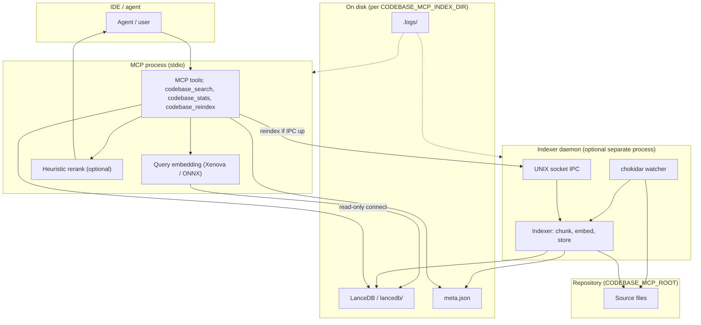
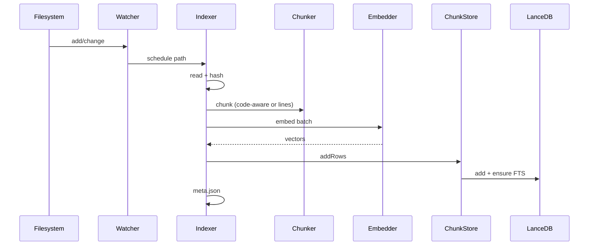
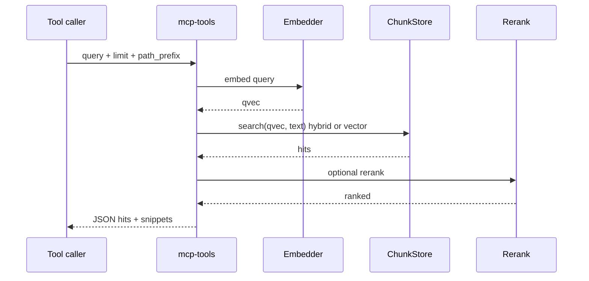

# Architecture overview

**codebase-mcp** is a local semantic search system for a repository: it indexes text files (with `.gitignore` + safety rules + optional path excludes), stores chunk embeddings in **LanceDB**, and exposes **MCP tools** for search and reindex. Query embedding and hybrid retrieval run in the **MCP** process; **ingest** (watch + embed + write) runs in a dedicated **indexing daemon** by default to avoid double watchers and a single writer to the vector table.

## System context



## Process models

Default: **two processes** — MCP (short-lived or long-lived stdio) + **one** long-lived **indexing daemon** per index directory. The daemon holds the file watcher; MCP opens Lance **read-only** for search and connects to the daemon **only** for `codebase_reindex` when available.

```mermaid
flowchart LR
  subgraph default["Default (CODEBASE_MCP_NO_DAEMON unset)"]
    M["MCP\n(main.js)"]
    D["codebase-mcp-daemon\n(daemon-entry.js)"]
    M -->|Lance read-only| DB[(LanceDB)]
    D -->|sole writer| DB
    M -.->|optional IPC: reindex| D
  end
```

Inline mode: **`CODEBASE_MCP_NO_DAEMON=1`** — one process runs MCP + watcher + indexer (no IPC).

| Doc | Focus |
|-----|--------|
| [Processes & deployment](processes.md) | Binaries, env modes, `main` entry graph |
| [Indexing pipeline](indexing.md) | Watcher, queue, chunking, embed, writes |
| [Search & retrieval](search.md) | Hybrid BM25+vector+RRF, rerank, tool shape |
| [Storage (LanceDB & meta)](storage.md) | Table schema, FTS index, paths |
| [Embeddings & ONNX](embeddings.md) | `ort-env-early`, session caps, Xenova |
| [Daemon IPC](daemon-ipc.md) | Socket, protocol, reindex, duplicate guard |
| [Configuration](config.md) | Env groupings, which process reads what |
| [Observability](observability.md) | Logs, file mirror, fatals |
| [Retrieval roadmap](../plan/code-aware-retrieval.md) | Code-aware search improvements (status) |

## End-to-end data flow

### Ingest (daemon or inline)



### Search (MCP)



## Repository layout (source)

| Area | Key modules |
|------|----------------|
| Entry | `main.ts`, `daemon-entry.ts` |
| Bootstrap | `indexing-bootstrap.ts` |
| Index | `indexer.ts`, `watcher.ts`, `chunker.ts` |
| Vectors + FTS | `store.ts` |
| ML | `embedder.ts`, `onnx-ort-caps.ts`, `ort-env-early.ts` |
| MCP | `mcp.ts`, `mcp-tools.ts`, `rerank.ts` |
| Daemon | `run-indexing-daemon.ts`, `daemon-server.ts`, `daemon-client.ts`, `daemon-connect.ts` |
| Config / paths | `config.ts`, `path-filters.ts`, `force-include.js`, `gitignore.ts` |
| I/O / logs | `logger.ts`, `log.ts`, `meta.ts` |

---

*For product-level notes, see the repo root [README](../../README.md).*
