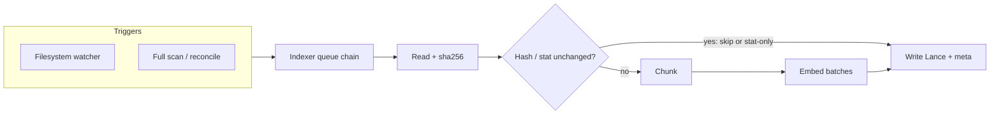

# Indexing pipeline

Ingestion turns repository files into **rows** in the Lance `chunks` table: path, line range, text, and embedding vector. The pipeline is **file-serial** per indexer queue: one file at a time is read, hashed, chunked, embedded in batches, and written.

## High-level flow

## Path selection

- **Walk / watch** — Repo is traversed and watched under `CODEBASE_MCP_ROOT`, respecting **root `.gitignore`** (via the `ignore` package), **`CODEBASE_MCP_FORCE_INCLUDE`**, and **`CODEBASE_MCP_INDEX_EXCLUDE`** (codebase-mcp–only ignore patterns; see [configuration](config.md)).
- **Safety** — e.g. `.git`, `node_modules`, and certain secret file patterns are always skipped (`path-filters.ts`).
- **Extensions** — `shouldConsiderExtension` allows known text-y extensions; others are ignored.

## Chunking

- **Line mode** — `chunkByLines*`: fixed window of `CODEBASE_MCP_CHUNK_LINES` with `CODEBASE_MCP_CHUNK_OVERLAP` (see `config.ts` defaults in README).
- **Code-aware mode** (default) — `chunkCodeAware`: heuristically detects symbol lines (JS/TS, Python, generic `func`/`class` patterns), splits on symbol boundaries, then falls back to line windows for long spans. Large files use **incremental** line array building and **yields to the event loop** to keep the daemon responsive (`event-loop-yield.ts`, `chunker.ts`).

**Embedding string** (what gets embedded) is not raw text alone: the indexer prepends `path=`, and optional `lang=`, `symbol=`, `kind=` tags for context (`indexer.ts` / `embeddingTextForChunk`).

## Embedding

- **Model** — `CODEBASE_MCP_EMBEDDING_MODEL` (default Jina v2 class via Xenova). First load can download to HuggingFace cache.
- **Batching** — `CODEBASE_MCP_EMBED_BATCH_SIZE` drives batch size; ONNX CPU caps and wasm threads are applied via `ort-env-early` + `onnx-ort-caps` (see [embeddings](embeddings.md)).

## Persistence

- **Lance** — `ChunkStore.addRows` / `deleteByPath` / first-time `ensureTableFromRows`.
- **Meta** — `meta.json` stores file hashes, stat cache, embedding model, last full scan time; used to skip re-read when mtime+size match.

## Full scan and reconcile

- **Full scan** — Enumerate walkable files, schedule each; progress logs include ordinal/total.
- **Reconcile** — Recompute walk set, **remove** index rows for paths no longer present, then run full scan. Invoked on a **timer** in the daemon (and in `NO_DAEMON` mode from `main`) and from **`codebase_reindex`** with no `path` argument.

## Related code

| Module | Role |
|--------|------|
| `indexer.ts` | `Indexer` class, walk, per-file body, `fullScan` / `reconcile` |
| `watcher.ts` | chokidar, ignore rules, `scheduleIndexFile` / `scheduleRemove` |
| `chunker.ts` | `chunkByLines`, `chunkCodeAware`, `buildLinesArray` |
| `indexing-bootstrap.ts` | `createRootGitignoreFilter`, `ChunkStore`, `Indexer`, watcher, initial full scan |
| `store.ts` | Lance add/delete, FTS `ensureFtsIndex` after writes |
| `meta.ts` | read/write `meta.json` |
