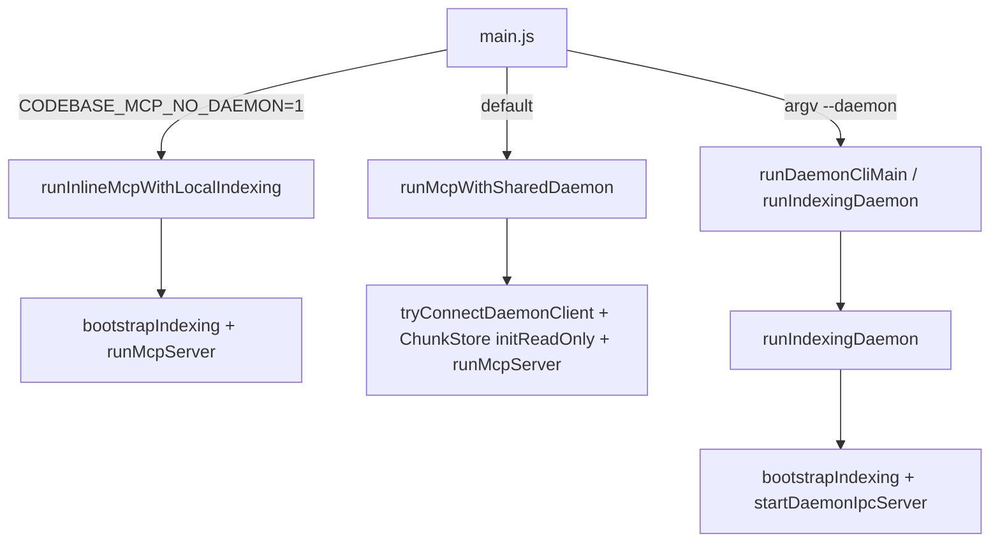

# Processes & deployment

## Binaries (package `bin`)

| Command | `package.json` entry | Role |
|--------|----------------------|------|
| `codebase-mcp` | `dist/main.js` | stdio **MCP server**; no indexer unless `CODEBASE_MCP_NO_DAEMON=1` |
| `codebase-mcp-daemon` | `dist/daemon-entry.js` | **Indexing daemon** only: watcher + indexer + IPC |

## Entry points

- **`--daemon`**: `main` dispatches to the same `runDaemonCliMain` as `codebase-mcp-daemon` (indexer + IPC for that index directory).
- **Default MCP**: `loadConfig` → file logging → `runMcpWithSharedDaemon`: opens Lance read-only, tries IPC connect for reindex, starts MCP server.
- **`NO_DAEMON`**: single process: `bootstrapIndexing` (watcher + indexer + `ChunkStore.init`) + periodic reconcile in-process + `createLocalMcpBackend` (search + reindex on same `Indexer`).

## Required environment

- **`CODEBASE_MCP_ROOT`**: absolute path to the repo to index; if unset, `loadConfig()` uses `process.cwd()`; set explicitly when the process is not started from the repo (e.g. some MCP/IDE stdio clients).

## Index directory layout (conceptual)

Under **`CODEBASE_MCP_INDEX_DIR`** (default `<ROOT>/.claude/codebase_mcp/db`):

- **`lancedb/`** — LanceDB database directory (vector table + optional FTS on `text`).
- **`meta.json`** — per-file hashes, stat cache, model id, `lastFullScanAt`.
- **`.codebase-mcp-daemon/`** — IPC socket (and related) for that index.
- **`.logs/`** — `mcp.log` / `daemon.log` (when file logging is enabled).

## Concurrency & ownership

- **Writer**: only the process that uses `ChunkStore.init()` (not `initReadOnly`) and runs the indexer should mutate Lance and `meta.json`. The default design fixes **one** daemon per `CODEBASE_MCP_INDEX_DIR`.
- **Readers**: any number of MCP processes can `initReadOnly()` the same Lance path for `codebase_search` / `codebase_stats`.

## Related code

- `src/main.ts` — routing and wrappers.
- `src/daemon-entry.ts` — thin wrapper to `runDaemonCliMain`.
- `src/daemon-cli.ts` — `loadConfig` + `runIndexingDaemon` (used by `main --daemon` and the daemon bin in some paths).
- `src/run-indexing-daemon.ts` — duplicate-daemon check, `bootstrapIndexing`, IPC server, reconcile interval.
