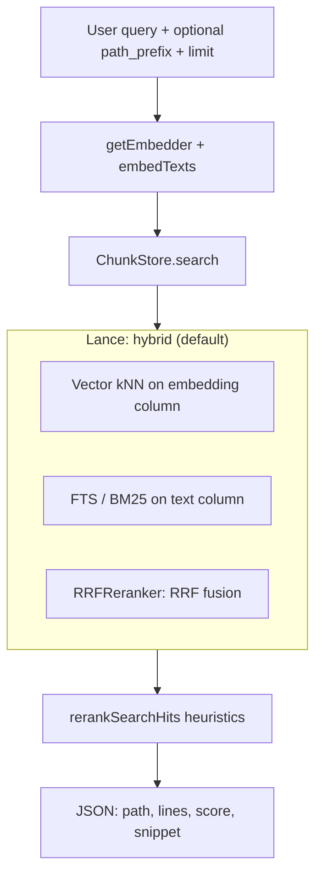

# Search & retrieval

`codebase_search` embeds the **user query** with the same model used at index time, retrieves candidates from Lance, optionally applies **lexical reranking**, and returns JSON to the agent.

## Pipeline

- **Candidate pool size** — `mcp-tools.ts` fetches at least `max(limit, CODEBASE_MCP_RERANK_CANDIDATES)` before rerank (see README defaults).
- **Hybrid (default on)** — When `CODEBASE_MCP_HYBRID` is true, an FTS index exists on `text`, and the query string is non-empty, `ChunkStore` runs **vector + full-text** search with **Lance’s `RRFReranker`** (RRF). If hybrid fails or the FTS index is missing (e.g. pure read-only MCP never ran a writer), the store **falls back to vector-only** (no user-visible error).
- **Rerank** — `rerank.ts` reorders hits using a weighted blend of vector/hybrid `score` plus **lexical** match, path hints, and simple **file-path priors** (e.g. prefer `src/`, de-prioritize tests/fixtures for symbol-like queries). Toggle with `CODEBASE_MCP_RERANK`.

## Tool surface

| Tool | Behavior |
|------|----------|
| `codebase_search` | `query` (required), `limit` (capped in schema, default 10), `path_prefix` (POSIX under repo) |
| `codebase_stats` | Needs either in-process `Indexer` or `meta` + store counts depending on backend |
| `codebase_reindex` | No `path` → `indexer.reconcile()`; with `path` → schedule that file. Default backend may require a **connected daemon** (see [daemon IPC](daemon-ipc.md)) |

## Backends

- **Local** (`createLocalMcpBackend`) — Full stats + reindex; used in `NO_DAEMON` mode.
- **Shared daemon** (`createSharedDaemonMcpBackend`) — Search/stats from local `ChunkStore` + `readMeta` when needed; reindex is **IPC to daemon** if the client connected at startup, otherwise a text hint (`DAEMON_REINDEX_HOWTO`).

## Related code

- `mcp-tools.ts` — `runCodebaseSearch`, `runCodebaseStats*`, `runCodebaseReindex`
- `mcp.ts` — Tool registration, Zod input schemas, backend wiring
- `store.ts` — `search({ queryVector, queryText, limit, pathPrefix })`
- `rerank.ts` — `rerankSearchHits`
- `embedder.ts` — `getEmbedder`, `embedTexts`
