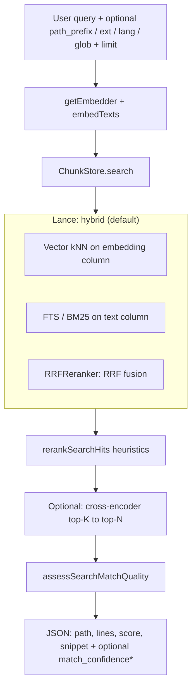

# Search & retrieval

`codebase_search` embeds the **user query** with the same model used at index time, retrieves candidates from Lance, optionally applies **heuristic reranking**, optionally a **cross-encoder** pass on the top-K pool (`CODEBASE_MCP_CROSS_ENCODER`), and returns JSON to the agent.

## Pipeline

- **Definition boost (optional)** — At index time, code-aware chunks that **start** at a detected declaration get `definition_of` in LanceDB. **TS/JS:** `interface` / `type` / `enum` plus functions/classes. **Ruby:** `def` / `def self.`, `class`, `module` (see `chunker.ts`). `definition-intent.ts` matches *“where is *X* defined?”* and phrasing with *class* / *interface* / *type* / *method* / *module* before *defined*. The reranker (or a sort when rerank is off) adds a path prior when `definition_of` matches. Tunable with `CODEBASE_MCP_DEF_BOOST` / `CODEBASE_MCP_DEF_STRENGTH`. The **embedding** string includes a `def=` prefix by default (`CODEBASE_MCP_EMBED_DEF_TAG`); set `0` for rerank-only. **Reindex** after changing chunker/intent; not a replacement for *Find references*.
- **Match confidence (optional)** — `search-confidence.ts` scores the **same** top-`limit` list returned to the client: `match_confidence`, reasons, a short `match_confidence_hint`, `top_primary_score` (uses `rerank_score` when rerank is on), and `top_relative_separation`. Tunable with `CODEBASE_MCP_MATCH_CONFIDENCE` / `CODEBASE_MCP_MATCH_CONF_*` (see README). A **high** that would be returned may be downgraded to **medium** for very short single-token queries (`MATCH_CONF_AMBIG_LIT`) or when the top-2 hits’ paths are different file *families* (e.g. Ruby vs TS / `MATCH_CONF_XDOMAIN_EXT`). This is a **heuristic**; scores are not globally calibrated.
- **Candidate pool size** — `mcp-tools.ts` fetches at least `max(limit, CODEBASE_MCP_RERANK_CANDIDATES)` before rerank (see README defaults).
- **Hybrid (default on)** — When `CODEBASE_MCP_HYBRID` is true, an FTS index exists on `text`, and the query string is non-empty, `ChunkStore` runs **vector + full-text** search with **Lance’s `RRFReranker`** (RRF). If hybrid fails or the FTS index is missing (e.g. pure read-only MCP never ran a writer), the store **falls back to vector-only** (no user-visible error).
- **Rerank** — `rerank.ts` reorders hits using a weighted blend of vector/hybrid `score` plus **lexical** match, path hints, **built-in path priors** (e.g. prefer `src/`, de-prioritize `spec/` / `test/` for *generic* queries), **optional flip to boost** those test trees when the query mentions `test` / `spec` / RSpec / Jest / … (`CODEBASE_MCP_TEST_PATH_QUERY_BOOST`), and optional **`CODEBASE_MCP_RERANK_DEMOTE_PATHS`**. Toggle with `CODEBASE_MCP_RERANK`.
- **Working-docs paths and search** — `CODEBASE_MCP_WORKING_DOCS_PATH` (e.g. default `.claude/docs` so gitignored plans/docs trees are still indexed) is read in the **indexer** (and the MCP, for the same list). By default, **`mcp-tools.ts` post-filters** unscoped search so those paths are **omitted** unless the tool call has a non-empty `path_prefix` that includes them (see `CODEBASE_MCP_SEARCH_EXCLUDE_FORCE_INCLUDE`). `ext` / `lang` / `glob` without `path_prefix` does **not** re-enable them; use `path_prefix` to target that area.
- **Cross-encoder (optional)** — `cross-encoder-rerank.ts` (Transformers.js / ONNX) scores **(query, chunk text)** for the first **K** hits after `rerankSearchHits`, then returns the best **N** = `limit`. Enable with **`CODEBASE_MCP_CROSS_ENCODER=1`** (default off). Replaces the displayed `score` with **sigmoid(logit)**; adds `cross_encoder_logit` in JSON when **`CODEBASE_MCP_RERANK_DEBUG_SCORES=1`**. On load/inference error, the pipeline **falls back** to the heuristic list.

## Tool surface

| Tool | Behavior |
|------|----------|
| `codebase_search` | `query` (required), `limit` (capped in schema, default 10), `path_prefix` (POSIX under repo), optional `ext` / `lang` / `glob` (see `path-query-filter.ts`; post-filter in `store.search`) |
| `codebase_stats` | Needs either in-process `Indexer` or `meta` + store counts depending on backend |
| `codebase_reindex` | No `path` → `indexer.reconcile()`; with `path` → schedule that file. Default backend may require a **connected daemon** (see [daemon IPC](daemon-ipc.md)) |

## Backends

- **Local** (`createLocalMcpBackend`) — Full stats + reindex; used in `NO_DAEMON` mode.
- **Shared daemon** (`createSharedDaemonMcpBackend`) — Search/stats from local `ChunkStore` + `readMeta` when needed; reindex is **IPC to daemon** if the client connected at startup, otherwise a text hint (`DAEMON_REINDEX_HOWTO`).

## Related code

- `mcp-tools.ts` — `runCodebaseSearch`, `runCodebaseStats*`, `runCodebaseReindex`
- `mcp.ts` — Tool registration, Zod input schemas, backend wiring
- `store.ts` — `search({ queryVector, queryText, limit, pathPrefix, pathFilter?, pathFilterNarrowing? })`
- `path-query-filter.ts` — `ext` / `lang` / `glob` → predicate (picomatch for `glob`)
- `rerank.ts` — `rerankSearchHits`
- `cross-encoder-rerank.ts` — optional BGE-style rerank
- `search-confidence.ts` — `assessSearchMatchQuality` (MCP output fields)
- `definition-intent.ts` — `parseDefinitionIntentQuery`, `orderHitsByDefinitionBoost`
- `embedder.ts` — `getEmbedder`, `embedTexts`
